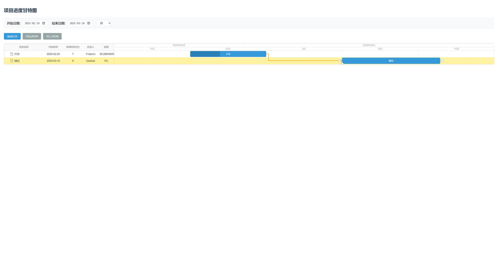

# Gantt-Chart

## 简介

一个绘制甘特图的小工具，使用 dhtmlx-gantt 和 vue-gantt-chart。

[在线体验地址](https://gantt.fridemn.best/)

## 功能

- 绘制甘特图
- 导出/导入 Json 文件





## 部署

首先要装有 node

安装依赖：

```bash
npm install
```

运行：

```bash
npm run serve
```
